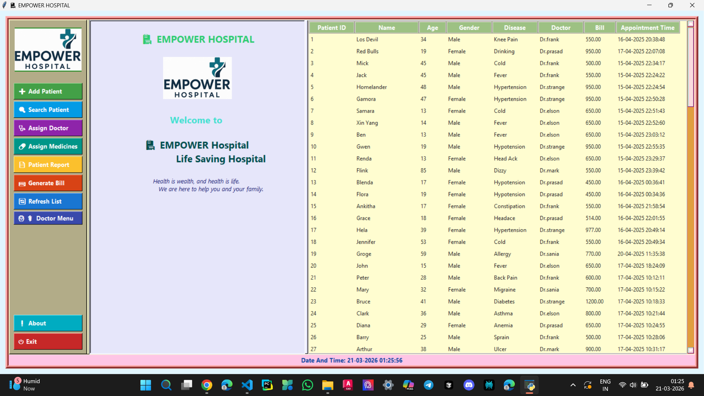
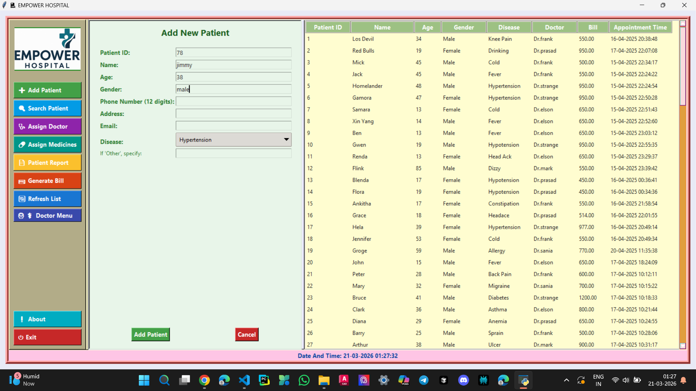
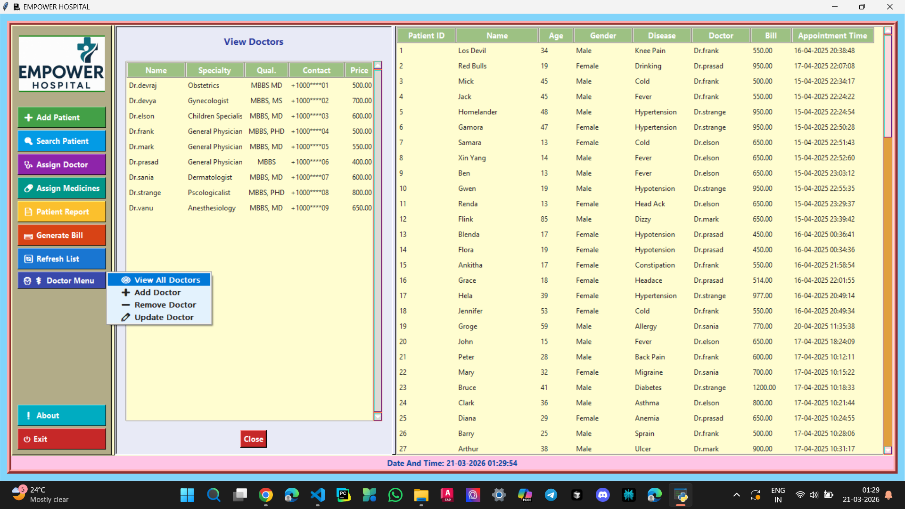
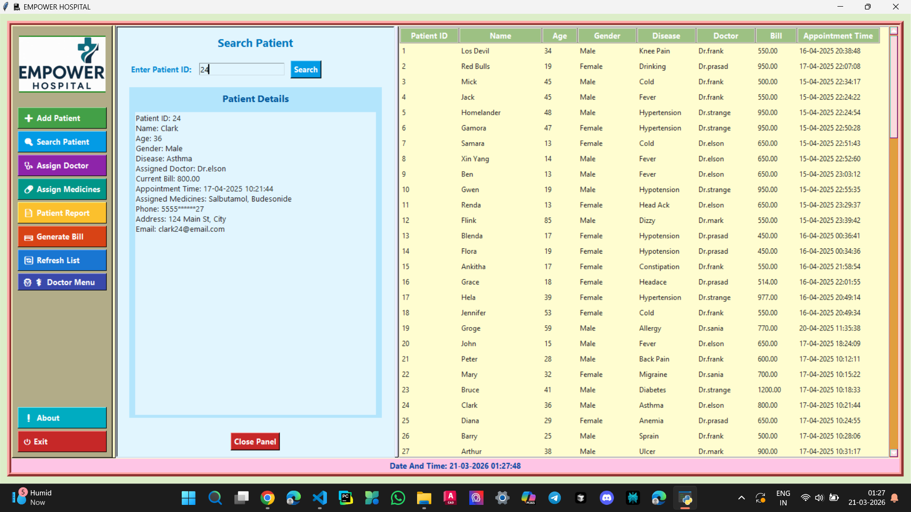
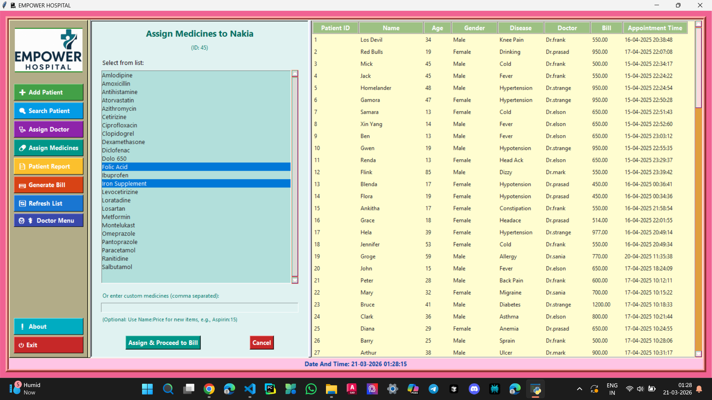
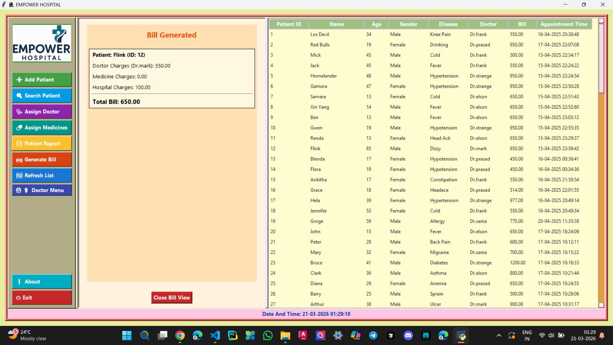
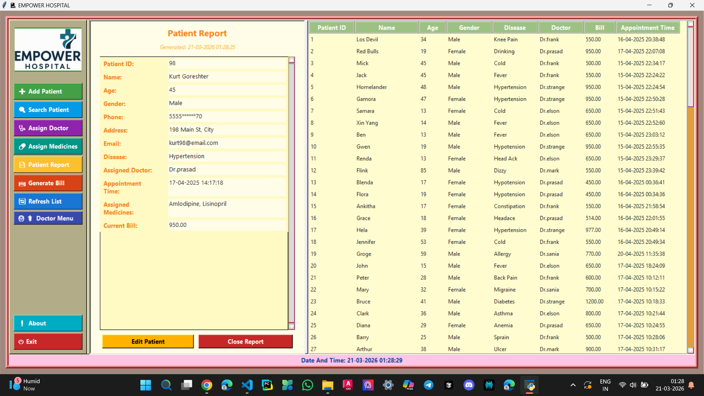
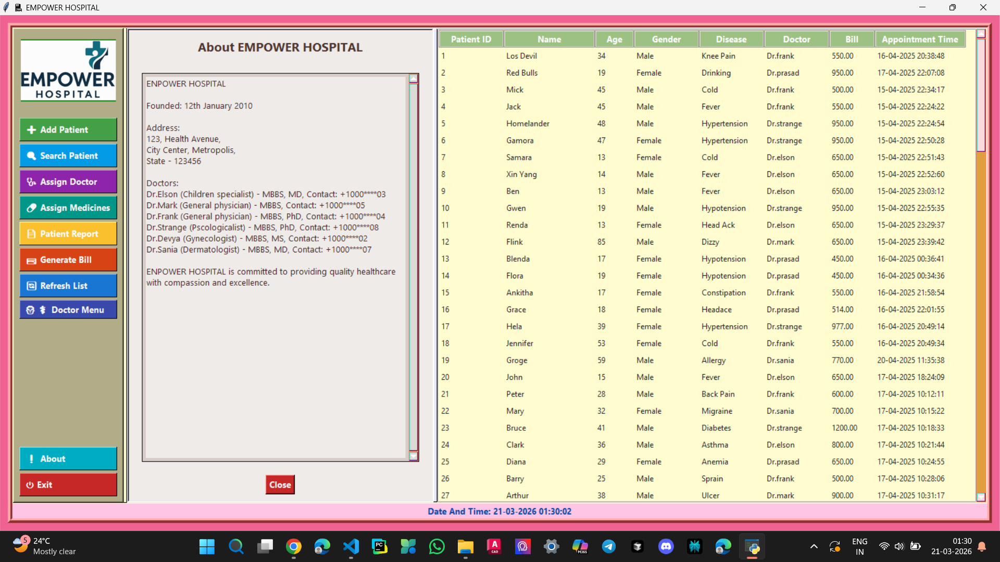

# 🏥 Hospital Management System (Desktop App)

A desktop-based hospital management application built using Python. The application runs locally and provides features to manage patients, doctors, and hospital data efficiently.

---

## 🚀 Features

- Patient management system  
- Doctor management  
- Medicine records  
- Data storage using text files  
- Modular code structure  
- User-friendly interface  

---

## 💻 Technologies Used

- Python  
- File Handling  

---

## 📁 Project Structure

- `main.py` → Entry point of the application  
- `app_gui.py` → Main GUI logic  
- `data_manager.py` → Handles data operations  
- `utils.py` → Utility functions  

### Folders:
- `panels/` → UI components  
- `config/` → Configuration files  
- `about/` → Additional info  

### Data Files:
- `patients.txt` → Patient records  
- `doctors.txt` → Doctor records  
- `medicines.txt` → Medicine data  

---

## ▶️ How to Run

1. Open project folder  
2. Run:

python main.py

## 📸 Screenshots

### 🏠 Main Interface

### 👤 Add Patient

### 🩺 Doctor Section

### 🔍 Search Patient

### 💊 Assign Medicines

### 🧾 Generated Bill

### 📊 Patients Report

### ℹ️ About Section

## ⚠️ Note

This project is developed for learning purposes

Data is stored using text files
